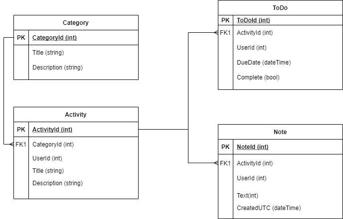

# TaskManager

The idea of the project is to manage tasks using Categories, Activities, Notes and Todo via Net Framework API Web Application using n-tier architecture.

## Contributors

Danielle Barrett, Atif Baloch, Holden Bouwers, & Jessica Klinck.

## Technologies Use 

Code was written using C# in Visual Studios.

## Project Breakdown

N-Tier = 4
1. Data, 2. Model, 3. Services and 4. Controller

1. Data: 	Category, Activity, Notes, Todo

2. Models:
Category
 (CategoryCreate, CategoryDetail, CategoryEdit, CategoryListItem)

 Activity
 (ActivityCreate, ActivityDetail, ActivityEdit, ActivityListItem)

Note
 (NoteCreate, NoteDetail, NoteEdit, NoteListItem)

Todo
 (TodoCreate, TodoDetail, TodoEdit, TodoListItem)

3. Services
   (CategoryService, ActivityService, NoteService, 	TodoService)

4. Controller
	 (CategoryController, ActivityController, 	NoteController, TodoController)

## Entity Relationship Diagram
 

## Usage

You can rename the current file by clicking the file name in the navigation bar or by clicking the **Rename** button in the file explorer.

## Resources
 - https://www.entityframeworktutorial.net/code-first/configure-one-to-one-relationship-in-code-first.aspx
 - https://docs.microsoft.com/en-us/aspnet/core/tutorials/first-web-api?view=aspnetcore-5.0&tabs=visual-studio
 - https://docs.microsoft.com/en-us/ef/core/saving/cascade-delete
 - https://zoom.us/rec/play/8jjfXEosuWooDztNNAvqNRSJfA0vWMrXPy3dH1UyIesCx-8OnkIh7NvBpiRaUyF1LWqzGZX71IrSG-jI.oE7GhlLk0rPvIdnn?continueMode=true&_x_zm_rtaid=VHk_XDYMR82iEBgcKPbqpQ.1613236523521.a83ab7eafbec05edecad1562ee85abbc&_x_zm_rhtaid=345
 - https://www.entityframeworktutorial.net/code-first/configure-one-to-one-relationship-in-code-first.aspx
 - https://stackoverflow.com/questions/4865873/the-alter-table-statement-conflicted-with-the-foreign-key-constrain
 - https://coderwall.com/p/sqmrog/3-easy-steps-to-create-webapi-documentations
 - https://docs.microsoft.com/en-us/aspnet/web-api/overview/getting-started-with-aspnet-web-api/creating-api-help-pages
